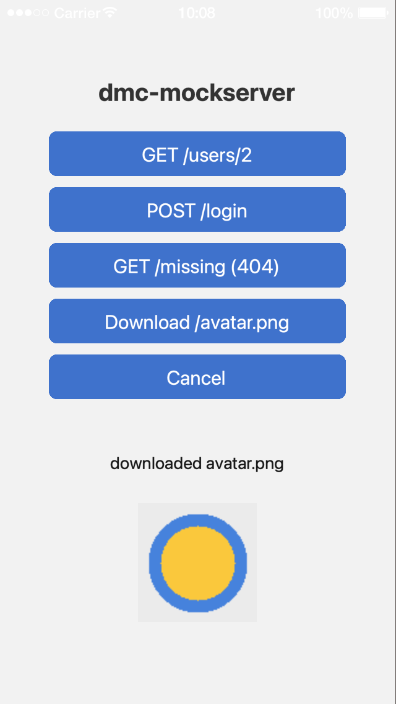

# Examples

Each folder is a complete Solar2D project with its own copy of the library: open its `main.lua` in the Solar2D Simulator.

| | |
|---|---|
|  | **dmc-mockserver-simple**: a mock server answers as if it were `https://api.example.com`. GET /users/2 and POST /login get JSON (from a function and from a string), GET /missing gets a 404, Download writes a bundled image to the temporary folder and shows it, and Cancel stops a request before its 800 ms delay is up. The responses and a request filter are at the top of `main.lua`. |
